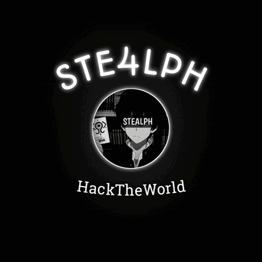

<h1 align="center">⚜️ Bienvenido a mi agujero del Ciberspacio ⚜️</h1>

#### Acerca de Mí

- 💻 Un navegante del ciberspacio.
- 🔭 Explorador de las profundidades de la web.
- 🧙‍♂️ Tejiendo realidades en el mundo digital.
- 📡 Buscando el código oculto en la matriz.

#### Proyectos Actuales

- 🌌 Creando realidades en el hilo del ciberspacio.
- 🛸 Explorando el lado oscuro de la tecnología.
- 🔍 Descifrando los secretos de la programación.

#### Aprendizaje Continuo

- 🐍 Domino el lenguaje Python.
- 🛠️ Creando herramientas para un futuro desconocido.
- 💬 Siempre dispuesto a conversar sobre el código y más.

#### Contacto

- 📫 Email: ste4lph@gmail.com
- 🌐 Perfil en Github: [Stealph en GitHub](https://github.com/ste4lph)

#### Recuerda

- ⚡ El conocimiento no tiene límite, el tiempo si.
- 🌠 Adentrate. Se curioso. Nunca te rindas. Se orgulloso.

¡Que la red esté siempre a tu favor! 🌐

